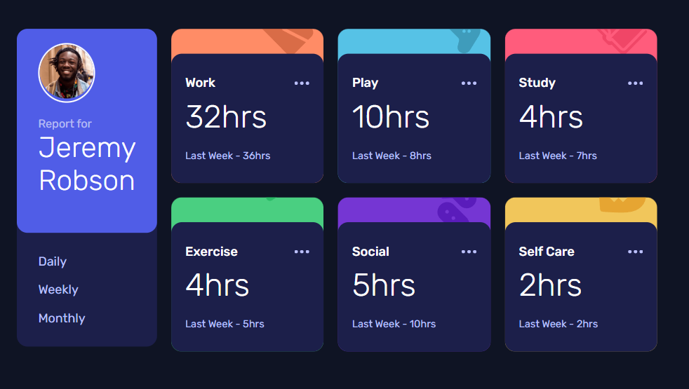
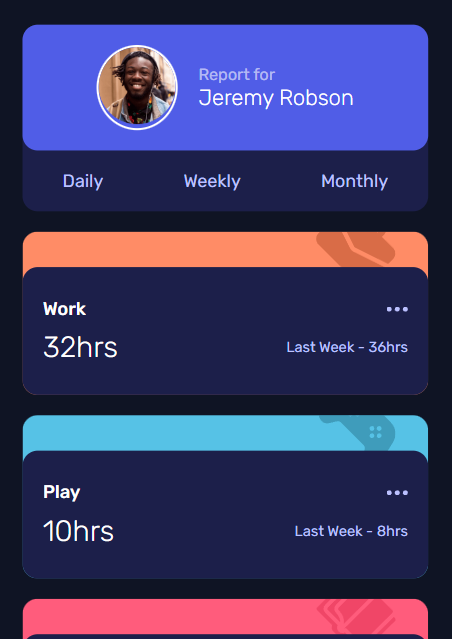

# Frontend Mentor - Time tracking dashboard solution

This is a solution to the [Time tracking dashboard challenge on Frontend Mentor](https://www.frontendmentor.io/challenges/time-tracking-dashboard-UIQ7167Jw). Frontend Mentor challenges help you improve your coding skills by building realistic projects. 

## Table of contents

- [Overview](#overview)
  - [The challenge](#the-challenge)
  - [Screenshot](#screenshot)
  - [Links](#links)
- [My process](#my-process)
  - [Built with](#built-with)
  - [What I learned](#what-i-learned)
  - [Continued development](#continued-development)
  - [Useful resources](#useful-resources)
- [Author](#author)
- [Acknowledgments](#acknowledgments)

**Note: Delete this note and update the table of contents based on what sections you keep.**

## Overview

### The challenge

Users should be able to:

- View the optimal layout for the site depending on their device's screen size
- See hover states for all interactive elements on the page
- Switch between viewing Daily, Weekly, and Monthly stats

### Screenshot

#### DESKTOP VIEW

#### MOBILES VIEW

### Links

- Solution URL: [Add solution URL here](https://github.com/micaji-251/PFEM-TimeTrackingDashboard)
- Live Site URL: [Add live site URL here](https://your-live-site-url.com)

## My process

### Built with

- Semantic HTML5 markup
- CSS custom properties
- Flexbox
- CSS Grid
- Mobile-first workflow
- Js Events
- Js Array Methods

### What I learned

function fetchJSONData() {
    fetch("./data.json")
        .then((res) => {
            if (!res.ok) {
                throw new Error
                    (`HTTP error! Status: ${res.status}`);
            }
            return res.json();
        })
        .then((data) => {
                dataArray = data;
                loadListeners();
            })
        .catch((error) => 
               console.error("Unable to fetch data:", error));

}

## Author

- Frontend Mentor - [@micaji-251](https://www.frontendmentor.io/profile/micaji-251)

